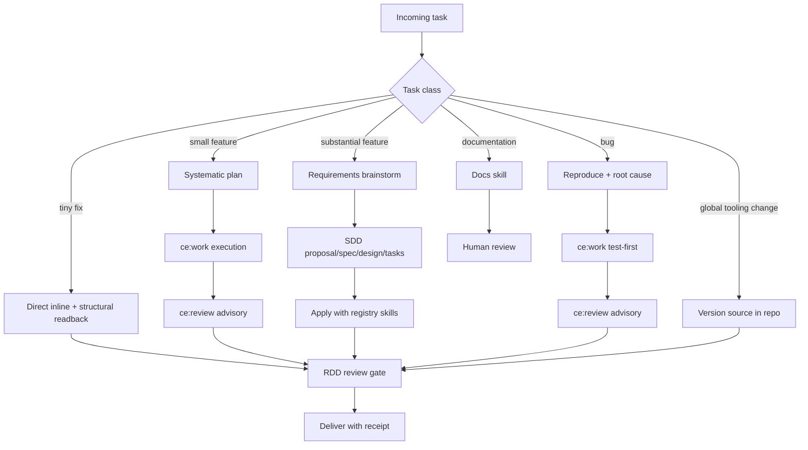

# WORKFLOW — Task Routing Recipe

**Origin:** [docs/brainstorms/2026-08-10-workflow-routing-requirements.md](docs/brainstorms/2026-08-10-workflow-routing-requirements.md)
**Plan:** [docs/plans/2026-08-10-001-feat-workflow-router-plan.md](docs/plans/2026-08-10-001-feat-workflow-router-plan.md)
**Log:** [ROUTER-LOG.md](ROUTER-LOG.md)

This recipe routes every incoming task to the right topology: Systematic for product thinking and discipline skills, gentle-ai SDD and receipt-driven review for durable execution and quality gates. **Classify every task by decision content, not file count.** If classification is ambiguous, ask the user and default to **substantial**.

## Task Classes

| Class | Signal | Route |
|---|---|---|
| **Tiny fix** | One-file mechanical change, no design decisions | Direct inline edit → structural readback (low-risk gate) → delivered with receipt |
| **Small feature** | Multi-file change with clear behavior; well-bounded | Systematic plan → **ce:work execution** (triage → task list → execution strategy → test-as-you-go → incremental commits) → ce:review (advisory, required) → RDD review gate |
| **Substantial feature** | Multi-file change with ambiguous behavior; new product territory | Requirements brainstorm → SDD (proposal → specs → design → tasks → apply → verify → archive) → RDD review gate → compound learning loop |
| **Bug investigation** | Bug report or failing behavior | Reproduce → root cause → **ce:work execution** (test-first, structured) → ce:review (advisory, required) → RDD review gate |
| **Documentation** | Docs, guides, onboarding, review-facing material | Matching docs skill (e.g., cognitive-doc-design) → human review |
| **Global tooling change** | Config, plugins, skills, or any change deployed outside a git repo (`~/.config/opencode/`, `~/.config/gentle-ai/`) | Version the artifact source in this workspace first → RDD review gate on the in-repo source → mirror the reviewed artifact to the deploy target |
| **Frontend / UI task** | UI design, layout, components, visual verification | Frontend lane (below) — `frontend-dev` design/verify → `frontend-apply` implement → vision analysis; standalone or inside an SDD change (hybrid) |



## Classification Rules

- **Decision content, not file count.** A multi-file *mechanical* change with no design decisions routes as a small feature, not a substantial one.
- Multi-file + clear behavior → **small**. Multi-file + ambiguous → **substantial**.
- Ambiguous classification → ask the user; default to **substantial**.
- **Re-classification is allowed at any planning boundary.** If execution reveals the true class differs (a small feature grows into multi-file ambiguous scope, or a substantial-looking request collapses to one file), re-run classification with user confirmation before proceeding past the current gate.

## Quality Gates

- **Receipt-driven review is the single *enforced* review gate for code** — every code change, regardless of class, passes it before delivery and ships with a receipt. RDD stays the gate that blocks delivery.
- **ce:review is the required advisory quality layer BEFORE the RDD gate** for substantial and small features: it adds coverage RDD structurally lacks (performance, API contract/versioning, migrations/schema drift, repo AGENTS.md compliance, agent-native accessibility, plan-requirements verification against the required brainstorm/plan artifacts, past learnings from `docs/solutions/`, stack-specific expertise). Its findings drive fixes that then pass the RDD gate. It is advisory and pre-gate — never a parallel second authority, never a delivery blocker by itself.
- Tiny fixes pass the gate in its low-risk form: **silent structural readback** — no planning ceremony, still receipted.
- ce:review also remains available where RDD is disabled, or for non-code artifacts (designs, docs).
- **Delivery strategy: ask-on-risk.** The chained-PR question fires only when the sdd-tasks review workload forecast exceeds **400 changed lines**; a change that crosses the threshold after the forecast still triggers the question before delivery.

## Required Thinking Layers (MANDATORY)

Systematic's thinking workflows are **required**, not optional, before durable execution — they are the quality floor. Each precondition is a hard gate: the next phase must not launch until the prior artifact exists.

| Class | Required precondition before SDD/implementation | Enforced by |
|---|---|---|
| **Substantial feature** | `ce:brainstorm` requirements doc MUST exist before SDD proposal launches (proposal is scoped to approach/design, not re-derived requirements) | Orchestrator gatekeeper refuses SDD propose without the requirements artifact |
| **Substantial feature (after archive)** | `ce:compound` MUST run after archive so learnings are recorded in `docs/solutions/` | Orchestrator gatekeeper refuses archive-close without the compound step |
| **Small feature** | `ce:plan` MUST complete before implementation starts | Orchestrator gatekeeper refuses implementation without a plan artifact |
| **Bug investigation** | `reproduce-bug` skill + test-first (`test-driven-development`) discipline REQUIRED in the fix | Apply prompt must carry the registry skill paths |
| **SDD apply (any code class)** | Registry-injected Systematic execution skills (TDD, frontend-design, reproduce-bug) MUST be loaded in the apply prompt | AE4 contract; apply prompt carries the skill paths |
| **Substantial + small features (pre-gate)** | `ce:review` MUST run as the advisory quality layer before the RDD gate, with its findings resolved before the gate | Orchestrator runs ce:review after implementation and before RDD start; findings become fixes, then the receipt gate |
| **Small feature + bug investigation (execution)** | `ce:work` MUST run as the structured execution layer between planning and review: triage → task list → execution strategy (inline / serial subagents / parallel past the parallel-safety check) → test-as-you-go → incremental conventional commits. It stops at its quality-check phase — shipping is the gate's job, not ce:work's Phase 4 | Orchestrator runs ce:work with the plan/repro-notes as input; its incremental commits feed ce:review → RDD |

**Gatekeeper rule:** if a phase tries to launch without its required Systematic precondition, STOP and produce the missing artifact first. Skipping the thinking layer is not an available optimization — output quality is the product.

## Frontend / UI Lane (hybrid)

Frontend-shaped work routes through the dedicated lane instead of the generic
implementation path, regardless of task class:

- **Standalone UI requests** (no SDD change): route to `frontend-dev`
  directly. It produces the spec, delegates implementation to
  `frontend-apply`, captures screenshots (playwright-cli), verifies visually,
  and iterates (max 3 rounds).
- **UI tasks inside an SDD change**: at `sdd-apply` launch the orchestrator
  splits the bundle — UI tasks → `frontend-dev` lane, non-UI tasks →
  `sdd-apply` — runs both in parallel (disjoint files) and merges results
  into apply-progress; `sdd-verify` still validates the whole change.
- **Vision stack (native-first)**: 1) the lane model's own native vision
  (`frontend-dev` = openai/gpt-5.6-sol), 2) the read-only `vision` subagent
  (openai/gpt-5.6-luna) for vision-less models, 3) the `describe_image`
  bridge (qwen3.6-plus via the opencode-go proxy) as last resort. Vision-less
  agents never attach images to messages (breaks fallback replays).
- **Operational requirements**: `subagent_depth: 3` in opencode.json (the
  chain orchestrator → dev → apply → vision needs it; default 1 blocks
  subagent→subagent); NEVER `bash background: true` in subagent sessions
  (hangs — start servers with foreground `nohup … &` + curl poll + pkill);
  screenshots must be saved inside the workspace (MCP path boundary rejects
  external paths).
- **E2E suite**: `vision/VISION-E2E.md` in the vision repo covers the whole
  stack (vision subagent, native-first, delegation, bridge, full design
  cycle, SDD hybrid). Re-run after touching lane config.

## Execution Skills (registry-injected)

The substantial-feature flow's apply phase carries Systematic's execution skills through the skill registry, so the apply agent loads them before work:

- `test-driven-development` — RED-GREEN-REFACTOR discipline for feature work
- `frontend-design` — design quality for UI work
- `reproduce-bug` — bug investigation discipline (used in the bug class)

## Global Tooling Changes

Changes that deploy outside a git repo (opencode plugins, config, skills) fall outside the native RDD gate's repo scope, so they follow this rule instead:

1. **Source lives in the repo first** — the reviewed artifact's source copy goes under `global-config/` in this workspace (e.g., `global-config/plugins/`).
2. **The gate reviews the source** — the RDD review runs on the in-repo source copy; the receipt certifies the source.
3. **Deployment is a mirror** — the external copy is a copy of the reviewed source, never edited in place. `verify-workflow.sh` re-mirrors it automatically if it drifts.
4. **Log the task** — one row in ROUTER-LOG.md with the deploy target noted in the evidence reference.

### Health-check plugin lifecycle (digest pin — do NOT skip)

The health-check plugin pins `verify-workflow.sh`'s sha256 and **refuses to execute a mismatched script** (fail-closed). Every edit to the script or its embedded heredocs REQUIRES the full re-pin cycle — forgetting it breaks the startup check with a FAILED banner in every session:

1. Edit `verify-workflow.sh` in this workspace.
2. Compute the new digest: `sha256sum verify-workflow.sh`.
3. Update `VERIFY_SCRIPT_SHA256` in `global-config/plugins/workflow-health-check.ts` with the new value.
4. Run the RDD review on the plugin source (source → gate → mirror).
5. Re-mirror the reviewed plugin: `bash verify-workflow.sh` (step 6 re-copies it) — verify `cmp` passes.
6. Log the task with the commit and receipt references.

**Checklist trigger:** ANY edit to `verify-workflow.sh` (including doc-only heredoc text) starts this cycle — a text-only change still changes the digest and still breaks the pin.

## Session Defaults

- **SDD preflight:** quality-first posture — interactive approval at planning boundaries; per-session pace and artifact store stay user-owned.
- **Coding model question** (local model vs opencode bridge): asked at coding start, user-owned.
- **Substantial-feature learning loop:** after archive, route outcomes through Systematic's `compound` skill so learnings are recorded.

## Logging

After every routed task — including probes — record one row in [ROUTER-LOG.md](ROUTER-LOG.md): date, task, class chosen, reclassification, gate outcome, probe flag, evidence reference. Probe rows are excluded from the prove-out count.

## Visible Evidence in Target Repos

The router must leave a trace **in the repo where the work happened**, not just in this workspace:

1. **Repo-local pointer** — every repo that participates in routing carries a `ROUTER-LOG.md` (or a one-section pointer in its `AGENTS.md`) naming the canonical recipe and its own log. Sessions there classify per the recipe and log rows locally.
2. **`ROUTED:` commit trailer** — commits produced by a routed task carry a trailer: `ROUTED: <class>@<gate-outcome> (router log row <date>)` — e.g. `ROUTED: small-feature@rdd-receipt (2026-08-12)`. Docs tasks use `ROUTED: documentation@human-review`.
3. **Central log still authoritative** — the workspace `ROUTER-LOG.md` remains the prove-out ledger; repo-local rows are the visible evidence and feed the same task list.
4. **Probes never leave trailers** — synthetic probe commits get no `ROUTED:` trailer; only real routed tasks do.

## Prove-Out (R12)

The runnable router stays deferred until the log shows **ten consecutive routed tasks across at least four task classes completing their flows without re-classification or gate escape** — with misclassifications logged to feed the encoding decision. At that point, encoding the router as a slash command, custom skill, or prompt section is triggered.

## After Updates (run this)

After updating opencode, Systematic, or gentle-ai, run the self-healing health check once:

```bash
bash verify-workflow.sh
```

It re-verifies and re-applies the three global pieces updates can touch: RDD mode (on), the skill symlinks (re-pointed to the active install if a package update moved it), and the routing section in the global opencode AGENTS.md (restored if sync removed it). Workspace files are safe — they live in this repo.
