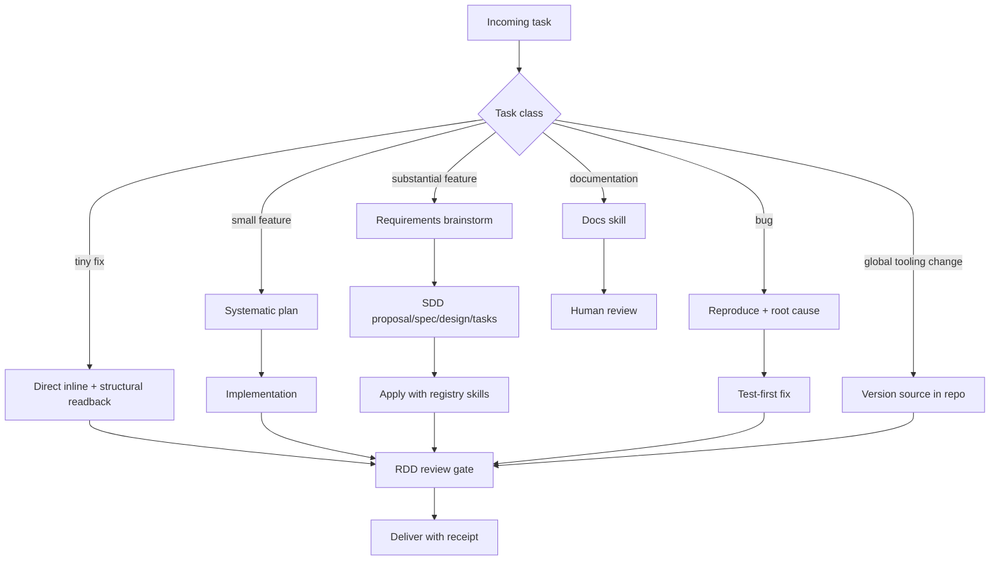

# WORKFLOW — Task Routing Recipe

**Origin:** [docs/brainstorms/2026-08-10-workflow-routing-requirements.md](docs/brainstorms/2026-08-10-workflow-routing-requirements.md)
**Plan:** [docs/plans/2026-08-10-001-feat-workflow-router-plan.md](docs/plans/2026-08-10-001-feat-workflow-router-plan.md)
**Log:** [ROUTER-LOG.md](ROUTER-LOG.md)

This recipe routes every incoming task to the right topology: Systematic for product thinking and discipline skills, gentle-ai SDD and receipt-driven review for durable execution and quality gates. **Classify every task by decision content, not file count.** If classification is ambiguous, ask the user and default to **substantial**.

## Task Classes

| Class | Signal | Route |
|---|---|---|
| **Tiny fix** | One-file mechanical change, no design decisions | Direct inline edit → structural readback (low-risk gate) → delivered with receipt |
| **Small feature** | Multi-file change with clear behavior; well-bounded | Systematic plan → implementation → RDD review gate |
| **Substantial feature** | Multi-file change with ambiguous behavior; new product territory | Requirements brainstorm → SDD (proposal → specs → design → tasks → apply → verify → archive) → RDD review gate → compound learning loop |
| **Bug investigation** | Bug report or failing behavior | Reproduce → root cause → test-first fix → RDD review gate |
| **Documentation** | Docs, guides, onboarding, review-facing material | Matching docs skill (e.g., cognitive-doc-design) → human review |
| **Global tooling change** | Config, plugins, skills, or any change deployed outside a git repo (`~/.config/opencode/`, `~/.config/gentle-ai/`) | Version the artifact source in this workspace first → RDD review gate on the in-repo source → mirror the reviewed artifact to the deploy target |



## Classification Rules

- **Decision content, not file count.** A multi-file *mechanical* change with no design decisions routes as a small feature, not a substantial one.
- Multi-file + clear behavior → **small**. Multi-file + ambiguous → **substantial**.
- Ambiguous classification → ask the user; default to **substantial**.
- **Re-classification is allowed at any planning boundary.** If execution reveals the true class differs (a small feature grows into multi-file ambiguous scope, or a substantial-looking request collapses to one file), re-run classification with user confirmation before proceeding past the current gate.

## Quality Gates

- **Receipt-driven review is the single enforced review gate for code** — every code change, regardless of class, passes it before delivery. ce:review is not run as a second gate on RDD-covered code.
- Tiny fixes pass the gate in its low-risk form: **silent structural readback** — no planning ceremony, still receipted.
- ce:review remains available where RDD is disabled, or for non-code artifacts (designs, docs).
- **Delivery strategy: ask-on-risk.** The chained-PR question fires only when the sdd-tasks review workload forecast exceeds **400 changed lines**; a change that crosses the threshold after the forecast still triggers the question before delivery.

## Execution Skills (registry-injected)

The substantial-feature flow's apply phase carries Systematic's execution skills through the skill registry, so the apply agent loads them before work:

- `test-driven-development` — RED-GREEN-REFACTOR discipline for feature work
- `frontend-design` — design quality for UI work
- `reproduce-bug` — bug investigation discipline (used in the bug class)

## Global Tooling Changes

Changes that deploy outside a git repo (opencode plugins, config, skills) fall outside the native RDD gate's repo scope, so they follow this rule instead:

1. **Source lives in the repo first** — the reviewed artifact's source copy goes under `global-config/` in this workspace (e.g., `global-config/plugins/`).
2. **The gate reviews the source** — the RDD review runs on the in-repo source copy; the receipt certifies the source.
3. **Deployment is a mirror** — the external copy is a copy of the reviewed source, never edited in place. `verify-workflow.sh` re-mirrors it automatically if it drifts.
4. **Log the task** — one row in ROUTER-LOG.md with the deploy target noted in the evidence reference.

## Session Defaults

- **SDD preflight:** quality-first posture — interactive approval at planning boundaries; per-session pace and artifact store stay user-owned.
- **Coding model question** (local model vs opencode bridge): asked at coding start, user-owned.
- **Substantial-feature learning loop:** after archive, route outcomes through Systematic's `compound` skill so learnings are recorded.

## Logging

After every routed task — including probes — record one row in [ROUTER-LOG.md](ROUTER-LOG.md): date, task, class chosen, reclassification, gate outcome, probe flag, evidence reference. Probe rows are excluded from the prove-out count.

## Visible Evidence in Target Repos

The router must leave a trace **in the repo where the work happened**, not just in this workspace:

1. **Repo-local pointer** — every repo that participates in routing carries a `ROUTER-LOG.md` (or a one-section pointer in its `AGENTS.md`) naming the canonical recipe and its own log. Sessions there classify per the recipe and log rows locally.
2. **`ROUTED:` commit trailer** — commits produced by a routed task carry a trailer: `ROUTED: <class>@<gate-outcome> (router log row <date>)` — e.g. `ROUTED: small-feature@rdd-receipt (2026-08-12)`. Docs tasks use `ROUTED: documentation@human-review`.
3. **Central log still authoritative** — the workspace `ROUTER-LOG.md` remains the prove-out ledger; repo-local rows are the visible evidence and feed the same task list.
4. **Probes never leave trailers** — synthetic probe commits get no `ROUTED:` trailer; only real routed tasks do.

## Prove-Out (R12)

The runnable router stays deferred until the log shows **ten consecutive routed tasks across at least four task classes completing their flows without re-classification or gate escape** — with misclassifications logged to feed the encoding decision. At that point, encoding the router as a slash command, custom skill, or prompt section is triggered.

## After Updates (run this)

After updating opencode, Systematic, or gentle-ai, run the self-healing health check once:

```bash
bash verify-workflow.sh
```

It re-verifies and re-applies the three global pieces updates can touch: RDD mode (on), the skill symlinks (re-pointed to the active install if a package update moved it), and the routing section in the global opencode AGENTS.md (restored if sync removed it). Workspace files are safe — they live in this repo.
