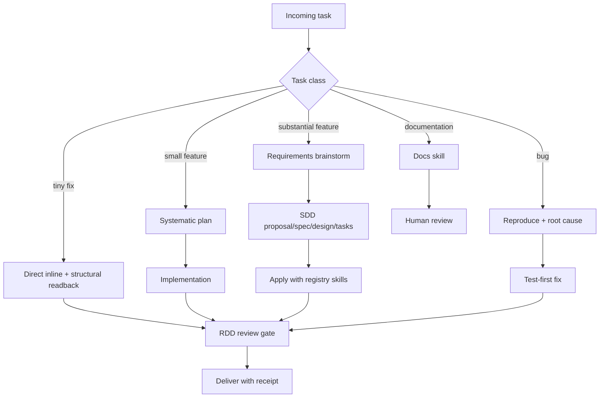

# Workflow Routing: gentle-ai and Systematic Division of Labor

## Summary

A task-type routing recipe that sends each piece of work to the right topology: Systematic for product thinking and discipline skills, gentle-ai SDD and receipt-driven review for durable execution and quality gates, with registry glue so SDD phases can load Systematic's execution skills. The recipe is documented as requirements here; planning will turn it into the router and the wiring.

---

## Problem Frame

The user runs two powerful systems whose planning and review surfaces overlap. gentle-ai provides SDD phases, receipt-driven review with enforced delivery gates, a skill registry, and cross-session memory. Systematic provides conversational brainstorm-to-plan workflows, rigid discipline skills (TDD, reproduce-bug, frontend design), and a learning loop. Without a routing decision, every incoming task reopens the same question: which system drives this?

The cost of leaving that question open is real. Applying SDD everywhere taxes small work with planning ceremony. Leaving review to unenforced workflows produces inconsistent quality. Running both planning layers without a boundary duplicates effort. The portfolio is mixed — features, maintenance, greenfield tools, docs — so no single fixed pipeline fits most tasks. Quality-first means skipping gates is not an acceptable optimization.

---

## Actors

- A1. User: owns decisions, approves scope at planning boundaries, answers preflight, consent, and delivery questions.
- A2. gentle-ai orchestrator: gatekeeps SDD phases and relays blocking prompts losslessly; routing in v1 is executed by the user following the documented recipe.
- A3. SDD phase agents (propose, spec, design, tasks, apply, verify, archive): execute the durable change lifecycle.
- A4. Native review facade and reviewers: enforce receipt-driven review gates on code changes.
- A5. Systematic workflow skills (brainstorm, plan, work, review, compound): product thinking, discipline injection, learning loop.

---

## Key Flows

- F1. Substantial feature
  - **Trigger:** New multi-file feature or ambiguous product request.
  - **Actors:** A1, A2, A3, A4, A5
  - **Steps:** Requirements brainstorm → SDD proposal/spec/design/tasks → apply with registry-injected Systematic skills → RDD review gate → verify → archive → learning loop.
  - **Outcome:** Durable artifacts plus a review receipt; learnings recorded.
  - **Covered by:** R3, R6, R8, R11, R14

- F2. Small feature
  - **Trigger:** Well-bounded feature with clear behavior.
  - **Actors:** A1, A2, A4, A5
  - **Steps:** Systematic plan → implementation → RDD review gate.
  - **Outcome:** Shipped change with a receipt certifying the change candidate against the Systematic plan; no SDD artifacts.
  - **Covered by:** R4, R6

- F3. Bug investigation
  - **Trigger:** Bug report or failing behavior.
  - **Actors:** A1, A2, A4, A5
  - **Steps:** Reproduce → root cause → test-first fix → RDD review gate.
  - **Outcome:** Regression covered by a test; fix receipted against reproduction notes and the failing test.
  - **Covered by:** R5, R6

- F4. Tiny fix
  - **Trigger:** One-file mechanical change with no design decisions.
  - **Actors:** A2, A4
  - **Steps:** Direct inline edit → structural readback (low-risk form of the enforced gate) → delivered with receipt.
  - **Outcome:** Change delivered without planning ceremony.
  - **Covered by:** R2, R6

- F5. Documentation
  - **Trigger:** Docs, guides, onboarding, or review-facing material.
  - **Actors:** A1, A2, A5
  - **Steps:** Matching docs skill → human review.
  - **Outcome:** Document delivered; no code review gate.
  - **Covered by:** R7

---

## Requirements

**[Routing by task class]**

- R1. The workflow defines six task classes — tiny fix, small feature, substantial feature, bug investigation, documentation, global tooling change — classified by decision content, not file count: multi-file changes with clear behavior route as small, ambiguous ones as substantial, and an ambiguous classification defaults to substantial with user confirmation.
- R2. Tiny fixes route to direct inline implementation with no planning ceremony; the enforced gate runs in its low-risk form (silent structural readback) and the change ships with a receipt.
- R3. Substantial features route through a requirements brainstorm, then through SDD planning (proposal, spec, design, tasks), apply, verify, and archive.
- R4. Small features route through Systematic planning to direct implementation; SDD planning is skipped.
- R5. Bug investigations reproduce and root-cause the failure before any fix, and fixes are written test-first.
- R6. Every code change, regardless of class, passes the enforced review gate before delivery.
- R7. Documentation work routes through the matching Systematic docs skill and human review, with no code review gate.

**[Quality gates]**

- R8. Receipt-driven review is the single *enforced* review gate for code — every code change passes it before delivery and ships with a receipt. ce:review is never a second enforced gate on RDD-covered code, but it IS the required advisory quality layer before the RDD gate for substantial and small features: it adds coverage RDD structurally lacks (performance, API contract/versioning, migrations/schema drift, repo AGENTS.md compliance, agent-native accessibility, plan-requirements verification, past learnings, stack-specific expertise), and its findings are resolved into fixes that then pass the enforced gate.
- R9. ce:review remains available where RDD is disabled or for non-code artifacts such as designs and docs.
- R10. Delivery strategy defaults to ask-on-risk: the chained-PR question fires only when the sdd-tasks review workload forecast exceeds 400 changed lines; a change that crosses the threshold after the forecast still triggers the question before delivery.

**[Integration glue]**

- R11. Systematic's execution-relevant skills (TDD, frontend design, reproduce-bug, and any others that add value inside SDD phases) are made loadable through gentle-ai's skill registry so apply agents receive their skill paths.
- R12. The router starts as this documented recipe; encoding it as a runnable command or skill is deferred until the recipe proves out in use — ten consecutive routed tasks across at least four task classes complete their flows without re-classification or gate escape, with misclassifications logged to feed the encoding decision.
- R13. Re-classification is allowed at any planning boundary: if execution reveals the task's true class differs from intake (for example, a small feature grows into multi-file scope, or a substantial-looking request collapses to a single file), classification re-runs with user confirmation before proceeding past the current gate.
- R14. After archive, the substantial-feature flow routes outcomes through Systematic's compound skill so learnings are recorded.

---

## Acceptance Examples

- AE1. **Covers R2.** Given a typo-level one-file fix, when the task is routed, implementation happens inline; the enforced gate runs as silent structural readback and the change ships with a receipt — no planning artifacts are produced.
- AE2. **Covers R3.** Given a new multi-file feature request, when routed as substantial, the change produces a requirements doc, SDD artifacts, and a review receipt before delivery.
- AE3. **Covers R6, R8.** Given an RDD-enabled repository with any code change, when review runs, only the native receipt gate applies — no persona review is launched as a second gate.
- AE4. **Covers R11.** Given an SDD apply phase, when launched, the apply agent's prompt carries registry-resolved skill paths for TDD and other matching discipline skills.
- AE5. **Covers R10.** Given an sdd-tasks forecast under 400 changed lines, when apply is about to launch, no chained-PR question fires; above the threshold, the user is asked before apply, and a change crossing the threshold late still triggers the question before delivery.
- AE6. **Covers R13.** Given a task routed as a small feature, when mid-implementation it grows into multi-file ambiguous scope, classification re-runs and the task re-enters as substantial with user confirmation before proceeding.

---

## Success Criteria

- The user can name the topology for any incoming task without hesitation — the routing question stops recurring.
- If receipt-driven review is enabled, every code change ships with an enforced review receipt; if it stays off, code review routes through ce:review per R9 — no task class silently skips review.
- A planner reading this doc can build the router and registry wiring without inventing product behavior beyond the documented options.
- Small work pays no SDD planning tax; substantial work never loses durability.

---

## Scope Boundaries

- No changes to either system's internals.
- No new CLI, plugin, or automation beyond the documented router and registry wiring.
- No bench journey validation of the workflow — future work.
- A runnable router skill is deferred (see R12).

---

## Key Decisions

- **RDD as the single enforced gate; ce:review demoted to off-RDD contexts.** Avoids double review ceremony while keeping quality-first.
- **Small features skip SDD planning; substantial features deliberately run both thinking layers.** Redundancy only where quality pays for it.
- **Delivery strategy defaults to ask-on-risk.** Works solo or in a team.
- **v1 router is documentation, not a runnable skill.** Encoding later is cheap once the recipe proves out.
- **Per-session SDD preflight stays user-owned.** Quality-first suggests interactive approval at planning boundaries.
- **Two thinking layers for substantial features.** The brainstorm's requirements doc becomes the input to the SDD proposal; the proposal is scoped to approach and design decisions rather than re-deriving requirements. The requirements-doc handoff is the boundary.

---

## Dependencies / Assumptions

- Receipt-driven review is enabled globally (verified via `gentle-ai review mode status`: global on, decided by global); the enforced gate in R6/R8 is active.
- The skill registry at `.atl/skill-registry.md` scans only `~/.config/opencode/skills`, `~/.claude/skills`, and `~/.codeium/windsurf/skills` today (verified in the registry file). Systematic's skills live outside those paths, so R11 needs explicit wiring.
- The coding-model question (local model vs opencode bridge, per AGENTS.md) stays user-owned at coding start; this workflow does not change it.

---

## Outstanding Questions

### Deferred to Planning

- [Affects R11][Technical] Registry glue mechanism: copy or symlink Systematic skill paths into the scanned sources, extend the scan, or author thin wrapper skills.
- [Affects R12][Needs research] Once the recipe proves out, which form should the runnable router take: slash command, custom skill, or prompt section?
