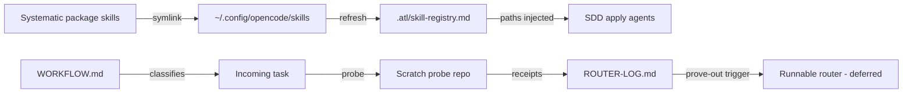

# feat: Workflow router and registry glue

**Target context:** This plan creates artifacts in the `workflow_optimisation` workspace and touches one user-level config directory (`~/.config/opencode/skills`, outside the repo) plus a scratch probe repo under the home workspace.

## Overview

The v1 router as a root-level recipe the user follows to classify every incoming task, symlink glue that makes Systematic's execution skills loadable inside gentle-ai SDD phases, a misclassification log feeding the deferred runnable-router decision, and real probe runs proving the receipt gates actually fire.

## Problem Frame

Two powerful systems overlap in planning and review, and without a routing decision every task reopens "which system drives this?". The requirements doc (see origin) established the division of labor; this plan executes it. RDD is already enabled globally (verified). What remains is making the recipe followable, the glue real, and the gates proven — not assumed.

## Requirements Trace

- R1-R10, R13, R14. Router recipe encodes the five task classes, decision-content classification, per-class flows, gates, reclassification, ask-on-risk threshold, and the compound learning-loop step.
- R11. Registry glue makes Systematic execution skills loadable through the skill registry.
- R12. Misclassification log feeds the prove-out trigger (ten consecutive routed tasks across at least four task classes without re-classification or gate escape); the router starts as the documented recipe, with runnable encoding deferred (Unit 1).
- AE1. Tiny-fix structural readback as the low-risk gate form.
- AE2. Substantial probe produces a requirements artifact, SDD artifacts, and a receipt.
- AE3. Only the native receipt gate applies to RDD-covered code; no persona review runs as a second gate.
- AE4. SDD apply agents receive registry-resolved skill paths (substantial probe through apply).
- AE5. Chained-PR question does not fire below the 400-line threshold (asserted during probes).
- AE6. Reclassification recorded when a probe crosses a planning boundary.
- SC1 (origin: user can name the topology for any task). Supported by Units 1 and 3.
- SC2 (origin: receipt on every code change; no class skips review). Verified by Unit 4 probes.

## Scope Boundaries

- No changes to either system's internals — glue uses symlinks into the already-scanned skill directory, never a scan-path change.
- No runnable router skill or command — deferred by R12 until the prove-out trigger fires.
- No bench journey validation — future work.
- ce:review behavior untouched.
- Verification probes run in a disposable scratch repo, never the user's real portfolio.

### Deferred to Separate Tasks

- Runnable router encoding (slash command, custom skill, or prompt section): future iteration once R12's trigger fires.
- Bench journey validation of the workflow: future work.

## Context & Research

### Relevant Code and Patterns

- `.atl/skill-registry.md` — registry contract: sources scanned are `~/.config/opencode/skills`, `~/.claude/skills`, `~/.codeium/windsurf/skills`; Systematic's skills live outside all three (verified in the registry file).
- `gentle-ai skill-registry refresh` — verified to have no scan-path configuration option, so the scanned directory itself is the only wiring point.
- `~/.config/opencode/skills/` — regular user skills such as work-unit-commits and go-testing already resolve through the registry (sdd-* and skill-registry are excluded by design); the glue mirrors that mechanism.
- `~/.cache/opencode/packages/@fro.bot/systematic@latest/.../skills/` — source of Systematic skills (`test-driven-development`, `frontend-design`, `reproduce-bug`). The path is a mutable install tag, not a version pin: the cache already holds two installs (a Jun 30 copy at `@latest` 2.32.1 and an Aug 9 copy at `@fro.bot/systematic` 3.6.0), so Unit 2 resolves the active install at link time and records its realpath.
- `docs/brainstorms/2026-08-10-workflow-routing-requirements.md` — the routing diagram and acceptance examples the recipe must encode.

### Institutional Learnings

- None — no `docs/solutions/` exists in this workspace yet. The probe results and glue behavior are candidates for the first `docs/solutions/` entry after execution.

### External References

- None — both systems are installed locally; their contracts are authoritative in-session (orchestrator contract, skill frontmatter).

## Key Technical Decisions

- **Symlinks, not wrappers or copies, for the glue.** Copies fork Systematic's skills and sever relative resource paths; wrappers change skill names and frontmatter expectations, risking trigger and content-integrity drift. Symlinks into the scanned directory preserve provenance and keep the registry resolving the originals. The install path is not version-pinned, so Unit 2 resolves the active install and records its realpath at link time, with a post-upgrade re-check.
- **Router recipe at workspace root (`WORKFLOW.md`).** The router is this workspace's product — the front door of the workflow — not buried under `docs/`. The requirements doc stays the origin; the recipe is the operative artifact.
- **Router log as a root-level markdown table (`ROUTER-LOG.md`).** One row per routed task, greppable and directly readable when the R12 prove-out trigger is evaluated. Unit 3 initializes the workspace as a real git repository so the log has history and conflict protection; a single-writer append convention guards concurrent sessions.
- **Real probe runs over structural readback.** Verification executes one task per class in a scratch repo and checks for actual receipts, so "gates fire" is proven rather than asserted (per the confirmed verification depth).
- **Probes are one-shot, recorded, and excluded from the prove-out count.** Each probe result lands in the log flagged as a probe; the R12 consecutive-count starts only after Unit 4 completes, so synthetic rows cannot trigger the runnable-router decision.

## High-Level Technical Design

> *This illustrates the intended approach and is directional guidance for review, not implementation specification. The implementing agent should treat it as context, not code to reproduce.*

## Implementation Units

- [x] **Unit 1: Router recipe document**

**Goal:** The v1 router — a root-level recipe the user follows to classify any incoming task and route it through the right topology with the right gates.

**Requirements:** R1-R10, R13, R14; origin flows F1-F5 and the routing diagram.

**Dependencies:** None.

**Files:**
- Create: `WORKFLOW.md`

**Approach:**
- Encode the five task classes with decision-content classification rules (multi-file + clear behavior → small; multi-file + ambiguous → substantial; ambiguity defaults to substantial with user confirmation).
- Per class: topology steps, actors, gate expectation (RDD receipt for code; structural readback for tiny fixes; human review for docs), and the reclassification rule at any planning boundary.
- Record the delivery defaults: ask-on-risk with the 400-changed-line threshold, late-growth re-check before delivery.
- Record the learning-loop step after archive for substantial features.
- Keep the origin's routing diagram as the recipe's visual anchor.
- Name the registry-injected execution skills (test-driven-development, frontend-design, reproduce-bug) in the substantial-feature flow so the recipe and the glue stay consistent (R11).
- No runnable automation — this is the documented recipe R12 defers encoding of.

**Patterns to follow:**
- The routing diagram and flow definitions in `docs/brainstorms/2026-08-10-workflow-routing-requirements.md`.
- `cognitive-doc-design` discipline for a low-cognitive-load operational doc.

**Test scenarios:**
- Test expectation: none — documentation artifact; correctness is verified by structural readback against the origin doc (R2's low-risk form of the gate) plus Unit 4's probe executions.

**Verification:**
- Every origin requirement R1-R14 is represented in the recipe without inventing behavior; the recipe's classification rules match the origin's decision-content rules verbatim; a reader can classify a sample task without ambiguity.

---

- [x] **Unit 2: Registry glue via symlinks**

**Goal:** Systematic's execution-relevant skills resolve through gentle-ai's skill registry so SDD apply agents receive their paths.

**Requirements:** R11; enables AE4.

**Dependencies:** None — mechanical ordering after Unit 1 for recipe/log consistency, not a technical dependency.

**Files:**
- Create (user-level, outside repo): symlinks in `~/.config/opencode/skills` pointing at Systematic's `test-driven-development`, `frontend-design`, and `reproduce-bug` skills
- Modify: `.atl/skill-registry.md` (via `gentle-ai skill-registry refresh`)

**Approach:**
- Resolve the active Systematic install before linking (compare `@fro.bot/systematic@latest` against `@fro.bot/systematic` and newer siblings; match the version opencode actually loads) and record the resolved realpath in the log.
- Symlink the three execution-relevant Systematic skills into the already-scanned user skill directory; do not copy or wrap them.
- Run `gentle-ai skill-registry refresh` and confirm the registry lists the symlinked skills with paths that resolve (via `ls -L` or equivalent read-only check).
- If the registry does not follow symlinks (implementation-time check), fall back to thin wrapper skills whose bodies load the originals by path; before accepting the deviation, verify the wrapper's name, frontmatter, and trigger parity with the original and record the check in the log.
- Do not touch `gentle-ai` internals or any scan-path configuration.
- Add a post-upgrade re-check step: after any opencode or Systematic update, re-run the realpath comparison and refresh the registry, since stale links otherwise pass resolution checks silently.

**Patterns to follow:**
- How existing skills in `~/.config/opencode/skills` appear in `.atl/skill-registry.md` today.

**Test scenarios:**
- Happy path: registry refresh output lists the three skills with resolvable paths.
- Edge case: symlink resolution — the registry entry's path resolves to the Systematic origin (checked via `ls -L` or equivalent read-only verification).
- Error path: if refresh reports a cache-hit without picking up new entries, force a full refresh and re-check.
- Error path (fallback): if the registry does not follow symlinks, create one thin wrapper, refresh, and verify its name/frontmatter/trigger parity with the original is documented in the log before accepting the deviation.

**Verification:**
- `.atl/skill-registry.md` contains entries for the three skills; opening each entry's path reaches the Systematic skill content; no scan-path or internals changes were made.

---

- [x] **Unit 3: Misclassification log**

**Goal:** A durable, greppable record of routed tasks that feeds the R12 prove-out trigger and captures reclassifications and gate outcomes.

**Requirements:** R12; supports SC1.

**Dependencies:** Unit 1 (recipe defines the classes the log records).

**Files:**
- Create: `ROUTER-LOG.md`

**Approach:**
- Define the row contract: date, task, class chosen, reclassification (none/from→to), gate outcome (receipt / readback / human review), probe flag (true/false), evidence reference, notes.
- Initialize the workspace as a real git repository (the `.git` stub exists but is not functional) before rows accumulate, so the log has history and conflict protection.
- State the prove-out rule verbatim from R12: ten consecutive routed tasks across at least four task classes complete their flows without re-classification or gate escape, with misclassifications logged to feed the encoding decision.
- Include a usage note: log after every routed task, including probes (flagged as probes); the prove-out count excludes probe rows and starts after Unit 4 completes.

**Test scenarios:**
- Test expectation: none — template artifact; its correctness is exercised by Unit 4's probe rows.

**Verification:**
- The log's row contract covers class, reclassification, and gate outcome; the prove-out rule matches R12; Unit 4 probe rows populate the first entries.

---

- [x] **Unit 4: Real probe verification**

**Goal:** Prove the router end-to-end: one executed task per class in a scratch repo, with real receipts, recorded into the log.

**Requirements:** AE1-AE6; SC2; R6, R8.

**Dependencies:** Units 1-3 (recipe to follow, glue wired, log ready).

**Files:**
- Create: scratch probe repo under the home workspace (e.g., `~/ai-workspace/probe-routing/`), git-initialized so RDD gates can fire
- Modify: `ROUTER-LOG.md` (probe rows)

**Approach:**
- Initialize the scratch repo, confirm `gentle-ai review mode status` reports `on` for it, and ensure the scratch repo's own skill registry includes the symlinked skills (refresh it there before the SDD probe).
- Execute one probe per class, smallest useful instance: tiny fix (one-file mechanical edit → structural readback receipt); small feature (Systematic plan → implementation → receipt); bug investigation (reproduce → root cause → test-first fix → receipt); documentation (docs skill → human review); substantial feature (requirements sketch → SDD propose/spec/tasks → apply → RDD review gate → receipt, sized to fit) — the substantial probe runs through apply so the AE4 prompt check has a real apply prompt to inspect.
- Record each probe row in `ROUTER-LOG.md` immediately after completion, flagged as a probe with an evidence reference.
- Archive per-probe evidence (receipt output, commit hashes, or a kept `probes/` copy of the probe repo) before deleting the scratch repo, so the prove-out evaluation can audit rows rather than trust self-reports; then delete the scratch repo (disposable by design) keeping log rows and archived evidence.

**Patterns to follow:**
- The class flows in `WORKFLOW.md`; native review facade behavior for low-risk candidates (silent structural readback, zero lenses).

**Test scenarios:**
- Happy path: each class probe completes its defined flow and produces its defined gate outcome (receipt / readback / human review).
- Edge case: tiny-fix probe produces a receipt via structural readback without launching a consent question (AE1/AE3).
- Integration: SDD apply probe prompt carries registry-resolved skill paths (AE4) — verified by inspecting the apply prompt for the symlinked skills.
- Integration: small and substantial probes assert the chained-PR question does not fire below the 400-line threshold (AE5).
- Integration: the small-feature probe deliberately starts ambiguous and is reclassified to substantial at the planning boundary with user confirmation; the reclassification row is recorded (AE6/R13).
- Error path: if any probe's gate does not fire, record the failure in the log, fix the cause in the recipe or glue, and re-run only that probe.

**Verification:**
- One completed probe row per task class in the log; at least four distinct classes exercised; each code-class probe shows a gate outcome; per-probe evidence archived; scratch repo removed.
- Before the router goes live, confirm the real execution workspace (where routed tasks will run) is a functional git repository with `gentle-ai review mode status` reporting `on` — the gate parity proven in scratch transfers to daily operation only if the real context satisfies the same preconditions.

## System-Wide Impact

- **Interaction graph:** The glue inserts three skills into the registry resolution path consumed by every SDD phase dispatch; the recipe changes how the user routes every incoming task.
- **Error propagation:** A broken symlink surfaces as a registry entry whose path fails to resolve — visible at refresh time, not at apply time.
- **State lifecycle risks:** Symlinks must survive Systematic package updates; the install tag is mutable (a second install already exists in the cache), so Unit 2 records the resolved realpath and adds a post-upgrade re-check — a stale link otherwise passes resolution checks silently.
- **API surface parity:** No public interfaces change; no gentle-ai or Systematic internals are modified; ce:review availability (R9) is untouched.
- **Integration coverage:** The SDD-apply prompt check (AE4) is the cross-layer scenario unit-level checks cannot prove.
- **Unchanged invariants:** Both systems' own behavior, the review-mode kill switch, the kinver coding-model question (user-owned per AGENTS.md), and existing skills in the scanned directory all remain exactly as they are.

## Risks & Dependencies

| Risk | Mitigation |
|------|------------|
| Registry does not follow symlinks | Unit 2 has a verified fallback (wrapper skills) recorded as a deviation; the fallback is visible before apply-time |
| Systematic package upgrade breaks or staleness the symlink targets | Active-install resolution at link time; realpath recorded; post-upgrade re-check (Unit 2) |
| Probes pollute review state or cost too much | Disposable scratch repo deleted after run; probes are minimal instances; substantial probe sized to fit |
| RDD gate behavior differs in scratch vs real repos | Probe repo is git-initialized and mode status verified `on` before probes run; real execution workspace verified the same way before go-live (Unit 4) |
| Recipe drifts from origin doc | Unit 1 verification reads back against the origin; probes re-validate class flows |

## Documentation / Operational Notes

- `WORKFLOW.md` becomes the daily operating document; `ROUTER-LOG.md` accumulates one row per routed task (probe rows flagged; workspace initialized as a git repo in Unit 3 for log integrity).
- After execution, the glue mechanism and probe results are candidates for the first `docs/solutions/` learning entry.
- The runnable-router encoding decision reopens when the log shows ten consecutive routed tasks across at least four task classes without re-classification or gate escape.

## Sources & References

- **Origin document:** [docs/brainstorms/2026-08-10-workflow-routing-requirements.md](docs/brainstorms/2026-08-10-workflow-routing-requirements.md)
- Registry contract: `.atl/skill-registry.md`
- Skill source: Systematic package skills under `~/.cache/opencode/packages/@fro.bot/systematic@latest/`
